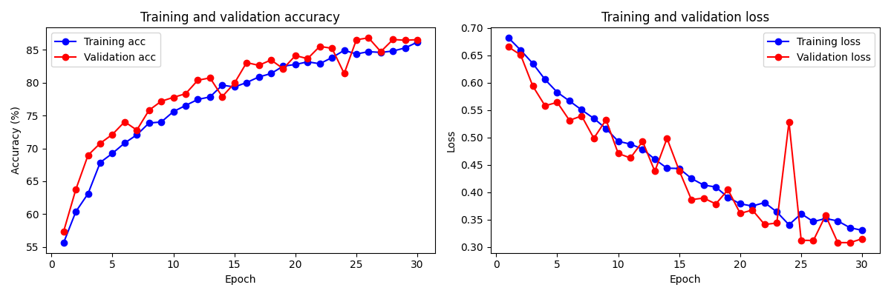

# 🐱 Cats vs. Dogs Image Classifier 🐶

## Project Overview

This project implements a Convolutional Neural Network (CNN) using PyTorch to tackle the classic computer vision challenge of classifying images as either cats or dogs. The goal was to build, train, and evaluate a deep learning model capable of accurately distinguishing between these two common pets from image data.

## How It Works

### Dataset

The model was trained on the "Dogs vs. Cats" dataset obtained from the Kaggle competition. This dataset provides thousands of labeled images for training. The raw Kaggle training data (`train.zip`) was automatically processed by the project script (`main.py`) which organized the images by:

1.  Splitting the data into training, validation, and test sets (using a ~70%/15%/15% ratio).
2.  Creating separate `cats` and `dogs` subdirectories within each set (`train`, `validation`, `test`).

### Data Preprocessing & Augmentation

Before being fed to the network, images are resized to 150x150 pixels and converted to RGB tensors. To improve model robustness and prevent overfitting, the following data augmentation techniques were applied *only* to the training set:

* Random Horizontal Flips
* Random Rotations (up to 40 degrees)
* Random Color Jitter (brightness, contrast, saturation)
* Standard normalization (using ImageNet mean and standard deviation) was applied to all sets.

### Model Architecture

A custom CNN was built using PyTorch's `nn.Module`. The architecture consists of:

1.  **Four Convolutional Blocks:** Each block contains `Conv2d` -> `ReLU` activation -> `MaxPool2d`. The number of filters progressively increases (3 -> 32 -> 64 -> 128 -> 128).
2.  **Flattening Layer:** To transition from convolutional feature maps to a flat vector.
3.  **Dropout Layers:** Incorporated after flattening and between fully connected layers (p=0.5) for regularization.
4.  **Two Fully Connected (Linear) Layers:** With a `ReLU` activation after the first. The final layer outputs a single logit.
5.  **Output Activation:** A `Sigmoid` function converts the logit into a probability score (0-1), indicating the likelihood of the image being a dog.

### Training Process

* The model was trained for 30 epochs using the Adam optimizer and Binary Cross-Entropy (BCELoss) loss function.
* Data was loaded in batches of 20 using PyTorch `DataLoader`.
* Training loss/accuracy and validation loss/accuracy were recorded at the end of each epoch.
* The model achieving the best validation performance during training could be saved, though the script saves the model from the final epoch as `cats_vs_dogs_cnn.pth`.

## 📈 Results

The model's performance was evaluated on the automatically generated test set (15% of the original Kaggle training data). The final test accuracy is printed to the console upon completion of the training script (`main.py`).

The learning curves for training and validation accuracy and loss over the epochs were plotted and saved:

*(Displays the plot of training/validation accuracy and loss over epochs)*
